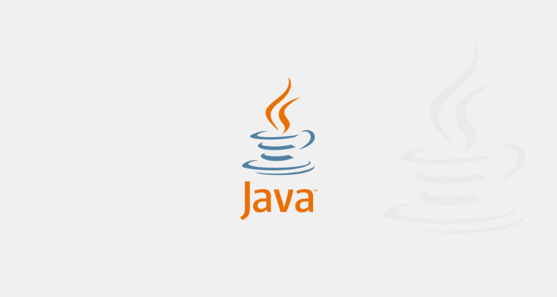

# Java: Consuming API

Project developed in the fourth course of Alura's Java training

## 🔨 Project Objectives

- Learn how to consume an HTTP API
- Data manipulation in JSON format; 
- Use the external GSON library to serialize and deserializa data;
- Error handling;
